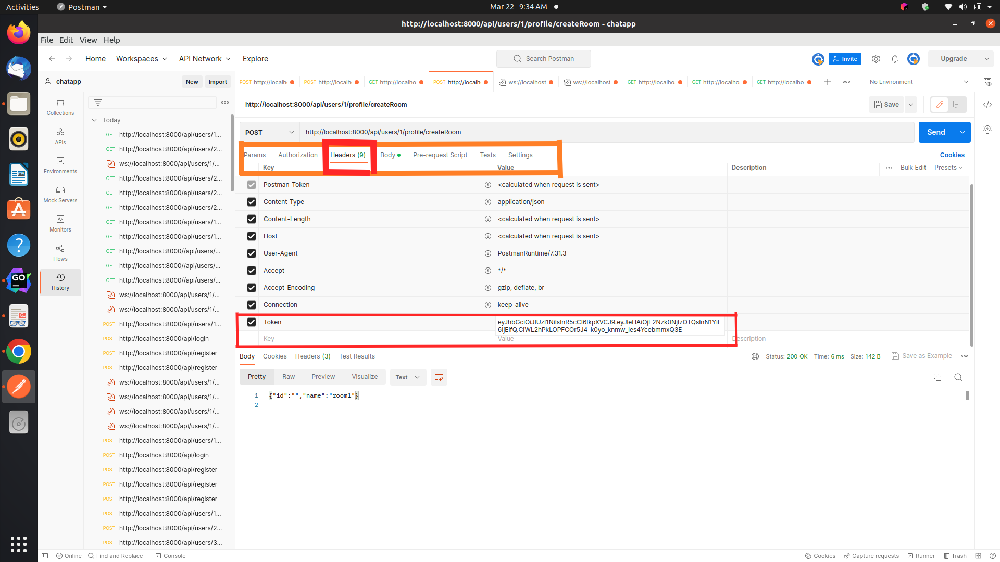
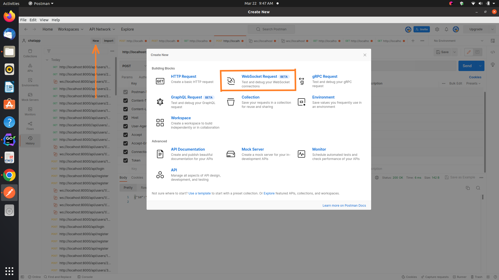

# Real Time Chat Application

In order to run this app in Docker follow step but make sure you have docker install on you system

## Run with Docker
```bash
https://github.com/bwithai/chat_app.git
cd chatapp
docker build -t chatapp .
docker run -p 8080:8080 chatapp
```
After starting the container, you can open a web browser and go to http://localhost:8080 to access the chat app.

## Run locally
```bash
https://github.com/bwithai/chat_app.git
cd chatapp
go mod download
go run main.go
```
### OR run with binary file 
creates a binary executable file named main in the working directory (/chatapp in this case). This binary file contains the compiled version of your entire Go application, not just the main.go file.
```bash
# After go mod download
# Build the binary
go build -o main .
# Run the binary
./main
```
# End Points
At Each time on application run. I refresh the database to delete all previous data. you can change it at `db/db.go`
#### 1. http://localhost:8000/api/register 
Allows a user to create an account.

#### 2. http://localhost:8000/api/login 
Allows a user to log in to their account. and set jwt cookies for front-end developer. login body ` {
"email": "example@gmail.com",
"password": "password"
}`

#### NoTe :
Once user login, It will Use the resources if it authorized, Keep in mind `ADD 'Token' as a key and 'JWT token' as value into http.Header` otherwise will be unauthorized for resources.



After login the path `/api/users/{userID}/profile` will be use for checking the Authorization like: users having profile `{userID}` Authorized for `...`

#### 3. http://localhost:8000/api/users/1/profile/logout
Allows a user to log out of their account. remove the set jwt cookies

[//]: # (#### 4. http://localhost:8000/api/users/1/profile/createRoom)
#### 4. http://localhost:8000//api/users/1/profile/chat/rooms
Returns a list of all available chat rooms. with the list of user who join which room.

#### 5. http://localhost:8000/api/users/1/profile/chat/rooms/1
`/api/users/{userID}/profile/chat/rooms/{roomId}` Returns the details of a specific chat room in this case Room1, with list of users who join Room1.

#### 6. http://localhost:8000/api/users/1/profile/createRoom
Allow user to create Room send body `{
"id": "1",
"name": "room1"
}`

#### 6. ws://localhost:8000/api/users/1/profile/chat/room/1/messages
Allows a user to send a message to a specific chat room. As you can see its not a http request its a websocket to join the Room1 and broadcast message to every one who joined the room but make sure 1st create that room.



#### 7. http://localhost:8000/api/users/1/profile/chat/rooms/1/messages
Returns a list of messages for a specific chat room.

## Explanation of used methods
### DB
In summary, this code creates a database and provides a way to access that database through the `GetDB()` function.


### jwt-go
https://github.com/dgrijalva/jwt-go jwt library


### auth_jwt
responsible for generate and validate jwt Token


### router
Handles HTTP routing for a chat application. It uses the Gorilla Mux router package to handle HTTP requests and defines 
routes. The InitRouter function sets up the routing handlers for the different routes.


### user
`user` that defines structs for handling user-related functionality in a chat application. The `User` struct defines the
fields for a user's ID, username, email, and password, and uses `gorm.Model` to define default fields like ID, `CreatedAt`,
`UpdatedAt`, and `DeletedAt`.

The `Repository` interface is used for storing and retrieving data from a database, and the `Service` interface defines 
methods that interact with the repository to create and login users.

`context.Context` is a type that is used to carry request-scoped data, cancellation signals, and deadlines across 
API boundaries and between processes.

1. user_handler.go: responsible for handling an HTTP request to create a new user.
2. user_service.go: responsible for creating a new user record in the database. 
3. user_db_interaction.go: responsible for interaction between user and database.


### utils
encrypting password using `bcrypt`
